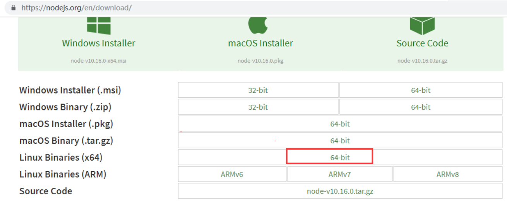

# json_server使用

## 参考资料

* [CentOS安装NodeJS](https://www.cnblogs.com/zhi-leaf/p/10979629.html)
* [github项目地址](https://github.com/typicode/json-server)
* [json-server搭建使用](https://www.cnblogs.com/xiaomili/p/7859969.html)
* [如何在Linux系统服务器上部署json-server服务](https://www.cqidc.cc/news/content/436.html)

---

## CentOS安装NodeJS

1、从官网下下载最新的nodejs，https://nodejs.org/en/download/



历史版本可从https://nodejs.org/dist/下载

2、通过MobaXterm工具上传到虚拟机，解压安装包

```
cd /home/nodejs/
tar -xvf node-v14.15.4-linux-x64.tar.xz
```

3、移动并改名文件夹（不改名也行）

```
cd /usr/local/
mv /home/nodejs/node-v14.15.4-linux-x64 .
mv node-v14.15.4-linux-x64/ nodejs
```

4、让npm和node命令全局生效

方式一: 环境变量方式

1. 加入环境变量，在 /etc/profile 文件末尾增加配置
```
vi /ect/profile
export PATH=$PATH:/usr/local/nodejs/bin
```
2. 执行命令使配置文件生效
```
source /etc/profile
```
方式二: 软链接方式（推荐）
```
ln -s /usr/local/nodejs/bin/npm /usr/local/bin/
ln -s /usr/local/nodejs/bin/node /usr/local/bin/
```

5、查看nodejs是否安装成功

```
[root@192 local]# node -v
v14.15.4
[root@192 local]# npm -v
6.14.10
[root@192 local]#

```


## json-server搭建使用

1、安装json-server

```
[root@192 json-server-master]# npm install json-server -g
/usr/local/nodejs/bin/json-server -> /usr/local/nodejs/lib/node_modules/json-server/lib/cli/bin.js
+ json-server@0.16.3
added 183 packages from 80 contributors in 53.593s
```

2、查看帮助

```
[root@192 json-server-master]# json-server
json-server [options] <source>

Options:
  -c, --config                   Path to config file
                                                   [default: "json-server.json"]
  -p, --port                     Set port                        [default: 3000]
  -H, --host                     Set host                 [default: "localhost"]
  -w, --watch                    Watch file(s)                         [boolean]
  -r, --routes                   Path to routes file
  -m, --middlewares              Paths to middleware files               [array]
  -s, --static                   Set static files directory
      --read-only, --ro          Allow only GET requests               [boolean]
      --no-cors, --nc            Disable Cross-Origin Resource Sharing [boolean]
      --no-gzip, --ng            Disable GZIP Content-Encoding         [boolean]
  -S, --snapshots                Set snapshots directory          [default: "."]
  -d, --delay                    Add delay to responses (ms)
  -i, --id                       Set database id property (e.g. _id)
                                                                 [default: "id"]
      --foreignKeySuffix, --fks  Set foreign key suffix (e.g. _id as in post_id)
                                                                 [default: "Id"]
  -q, --quiet                    Suppress log messages from output     [boolean]
  -h, --help                     Show help                             [boolean]
  -v, --version                  Show version number                   [boolean]

Examples:
  json-server db.json
  json-server file.js
  json-server http://example.com/db.json

https://github.com/typicode/json-server

Missing <source> argument
```

3、运行测试实例（发现虚机上 http://localhost:3000/posts ,本地电脑不能访问）

```
[root@192 json-server-master]# json-server --watch db.json

  \{^_^}/ hi!

  Loading db.json
  Done

  Resources
  http://localhost:3000/posts
  http://localhost:3000/comments
  http://localhost:3000/profile

  Home
  http://localhost:3000

  Type s + enter at any time to create a snapshot of the database
  Watching...
GET /posts 200 77.016 ms - 77
GET /posts/1 200 232.406 ms - 63
GET /posts?title_like+ser 200 28.202 ms - 77
GET /posts?q=internet 200 137.208 ms - 2
```

4、通过参数使得本地电脑也能访问
```
[root@192 ~]# cd /home/json_server/json-server-master/
[root@192 json-server-master]#  json-server --host 192.168.2.231 --watch db.json

  \{^_^}/ hi!

  Loading db.json
  Done

  Resources
  http://192.168.2.231:3000/posts
  http://192.168.2.231:3000/comments
  http://192.168.2.231:3000/profile

  Home
  http://192.168.2.231:3000

  Type s + enter at any time to create a snapshot of the database
  Watching...

GET /posts 200 12.155 ms - 77
PUT /posts/1 200 6.007 ms - 60
GET /posts 200 7.852 ms - 358
DELETE /posts/1 200 45.060 ms - 2
GET /posts?q=3 200 5.566 ms - 73
GET /posts?id_like=4 304 11.039 

```

5、特点分析

* If you make POST, PUT, PATCH or DELETE requests, changes will be automatically and safely saved to db.json using lowdb.

排序: **Sort**

```
http://192.168.2.231:3000/posts?_sort=id&_order=asc
http://192.168.2.231:3000/posts?_sort=id&_order=desc
```

模糊匹配: **Add _like to filter (RegExp supported)**

```
http://192.168.2.231:3000/posts?id_like=4

[
  {
    "title": "hello world",
    "author": "json",
    "id": 4
  }
]
```

全文检索: **Full-text search**

```
http://192.168.2.231:3000/posts?q=3

[
  {
    "title": "hello world",
    "author": "json",
    "id": 3
  }
]
```


