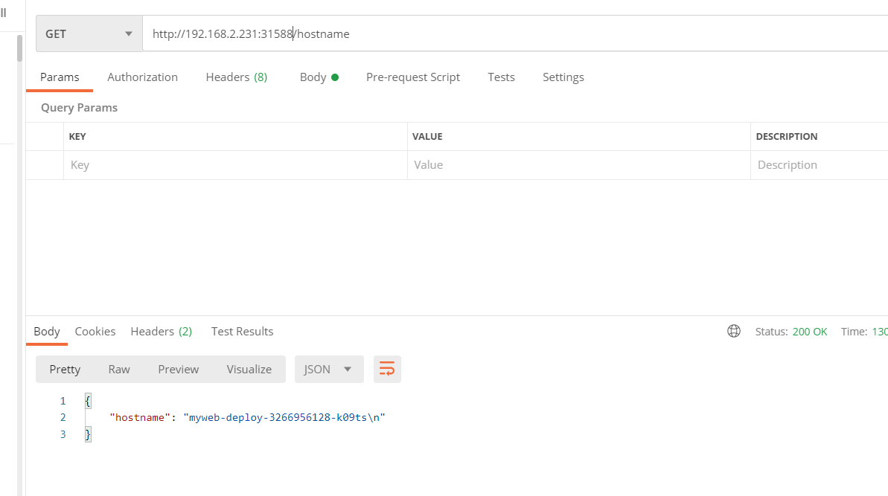

# Service

Kubernetes [`Pod`]是有生命周期的，它们可以被创建，也可以被销毁，然而一旦被销毁生命就永远结束。 
通过 [`ReplicationController`] 能够动态地创建和销毁 Pod。 每个 Pod 都会获取它自己的 IP 地址，即使这些 IP 地址不总是稳定可依赖的。这会导致一个问题：在 Kubernetes 集群中，如果一组 Pod（称为 backend）为其它 Pod （称为 frontend）提供服务，那么那些 frontend 该如何发现，并连接到这组 `Pod` 中的哪些 backend 呢？

## 关于 Service

Kubernetes `Service` 定义了这样一种抽象：一个 `Pod` 的逻辑分组，一种可以访问它们的策略 —— 通常称为微服务。这一组 Pod 能够被 Service 访问到，通常是通过 [`Label Selector`]。

举个例子，考虑一个图片处理 backend，它运行了3个副本。这些副本是可互换的 —— frontend 不需要关心它们调用了哪个 backend 副本。然而组成这一组 backend 程序的 Pod 实际上可能会发生变化，frontend 客户端不应该也没必要知道，而且也不需要跟踪这一组 backend 的状态。Service 定义的抽象能够解耦这种关联。

对 Kubernetes 集群中的应用，Kubernetes 提供了简单的 Endpoints API，只要 Service 中的一组 Pod 发生变更，应用程序就会被更新。对非 Kubernetes 集群中的应用，Kubernetes 提供了基于 VIP 的网桥的方式访问 Service，再由 Service 重定向到 backend Pod。

## 定义 Service

一个 `Service` 在 Kubernetes 中是一个 REST 对象，和 `Pod` 类似。
像所有的 REST 对象一样， `Service` 定义可以基于 POST 方式，请求 apiserver 创建新的实例。
例如，假定有一组 `Pod`，它们对外暴露了 9950 端口，同时还被打上 `"app: myweb release: stabel"` 标签。

```yaml
apiVersion: v1
kind: Service
metadata:
  name: myweb-service
  namespace: default
spec:
  type: ClusterIP
  selector:
    app: myweb
    release: stabel
  ports:
  - name: http
    port: 80
    targetPort: 9950
```

上述配置将创建一个名称为 “myweb-service” 的 `Service` 对象，它会将请求代理到使用 TCP 端口 9950，并且具有标签 `"app: myweb release: stabel"` 的 `Pod` 上。这个 `Service` 将被指派一个 IP 地址（通常称为 “Cluster IP”），它会被服务的代理使用（见下面）。该 `Service` 的 selector 将会持续评估，处理结果将被 POST 到一个名称为 “myweb-service” 的 `Endpoints` 对象上。

需要注意的是， `Service` 能够将一个接收端口映射到任意的 `targetPort`。默认情况下，`targetPort` 将被设置为与 `port` 字段相同的值。更有趣的是，`targetPort` 可以是一个字符串，引用了 backend `Pod` 的一个端口的名称。但是，实际指派给该端口名称的端口号，在每个 backend `Pod` 中可能并不相同。对于部署和设计 `Service` ，这种方式会提供更大的灵活性。例如，可以在 backend 软件下一个版本中，修改 Pod 暴露的端口，并不会中断客户端的调用。

Kubernetes `Service` 支持 `TCP` 和 `UDP` 协议，默认 `TCP` 协议。

使用举例如下：
```
根据myweb-deploy.yaml创建deployment资源，它通过rs管理3个pod对象
[root@192 docker]# kubectl apply -f myweb-deploy.yaml
deployment "myweb-deploy" created

查看myweb-deploy的rs
[root@192 docker]# kubectl get rs
NAME                          DESIRED   CURRENT   READY     AGE
myweb-deploy-3266956128       3         3         3         28m

查看myweb-deploy-3266956128管理的3个pod
[root@192 docker]# kubectl get pod -o wide
NAME                                READY     STATUS    RESTARTS   AGE                               IP           NODE
myweb-deploy-3266956128-jd4x6       1/1       Running   0          37s                               172.17.0.7   127.0.0.1
myweb-deploy-3266956128-k09ts       1/1       Running   0          37s                               172.17.0.8   127.0.0.1
myweb-deploy-3266956128-s3vs1       1/1       Running   0          37s                               172.17.0.9   127.0.0.1

通过内网IP访问，对应资源：
[root@192 docker]# curl 172.17.0.7:9950/hostname

{
        "hostname" : "myweb-deploy-3266956128-jd4x6\n"
}
[root@192 docker]# curl 172.17.0.8:9950/hostname

{
        "hostname" : "myweb-deploy-3266956128-k09ts\n"
}

创建Service来管理上述3个pod节点
[root@192 docker]# kubectl apply -f myweb-service.yaml
service "myweb-service" created
[root@192 docker]# kubectl get svc
NAME            CLUSTER-IP       EXTERNAL-IP   PORT(S)          AGE
kubernetes      10.254.0.1       <none>        443/TCP          14d
mysql           10.254.253.220   <none>        3306/TCP         14d
myweb           10.254.205.120   <nodes>       8080:30001/TCP   14d
myweb-service   10.254.228.221   <none>        80/TCP           19s

通过访问CLUSTER-IP，去获取3个pod的hostname资源内容
[root@192 docker]# curl 10.254.228.221:80/hostname

{
        "hostname" : "myweb-deploy-3266956128-jd4x6\n"
}
[root@192 docker]# curl 10.254.228.221:80/hostname

{
        "hostname" : "myweb-deploy-3266956128-s3vs1\n"
}
[root@192 docker]# curl 10.254.228.221:80/hostname

{
        "hostname" : "myweb-deploy-3266956128-k09ts\n"
}
```

## 外部通信-NodePort

Kubernetes的Pod IP和Cluster IP都只能在集群内部访问，而我们通常需要从外部网络上访问集群中的某些服务，Kubernetes提供了下述几种方式来为集群提供外部流量入口。

### NodePort
NodePort在集群中的主机节点上为Service提供一个代理端口，以允许从主机网络上对Service进行访问。

nodeport.yaml文件如下：
```yaml
apiVersion: v1
kind: Service
metadata:
  name: myweb-service
  namespace: default
spec:
  type: NodePort
  selector:
    app: myweb
    release: stabel
  ports:
  - name: http
    port: 9910
    targetPort: 9950
```

具体操作过程：
```
创建一个nodeport类型的service:
[root@192 docker]# kubectl apply -f nodeport.yaml
service "myweb-service" created

查看创建的service，可以看到k8s创建了一个名为myweb-service的service，并为该service在主机节点上创建了31588这个Nodeport。
[root@192 docker]# kubectl get svc
NAME            CLUSTER-IP       EXTERNAL-IP   PORT(S)          AGE
kubernetes      10.254.0.1       <none>        443/TCP          14d
mysql           10.254.253.220   <none>        3306/TCP         14d
myweb           10.254.205.120   <nodes>       8080:30001/TCP   14d
myweb-service   10.254.148.80    <nodes>       9910:31588/TCP   20s

可以通过CLUSTER-IP 访问
[root@192 docker]# curl 10.254.148.80:9910/hostname

{
        "hostname" : "myweb-deploy-3266956128-s3vs1\n"
}
[root@192 docker]# curl 10.254.148.80:9910/hostname

{
        "hostname" : "myweb-deploy-3266956128-jd4x6\n"
}

myweb-service后端对应3个Pod，其Pod的IP分别为172.17.0.7,172.17.0.8,172.17.0.9。
[root@192 docker]# kubectl get pod -o wide
NAME                                READY     STATUS    RESTARTS   AGE       IP           NODE
myweb-deploy-3266956128-jd4x6       1/1       Running   0          1h        172.17.0.7   127.0.0.1
myweb-deploy-3266956128-k09ts       1/1       Running   0          1h        172.17.0.8   127.0.0.1
myweb-deploy-3266956128-s3vs1       1/1       Running   0          1h        172.17.0.9   127.0.0.1


通过netstat命令可以看到Kube-proxy在主机网络上创建了31588监听端口，用于接收从主机网络进入的外部流量。
[root@192 docker]# ipvsadm -Ln |grep 31588
bash: ipvsadm: command not found...
[root@192 docker]# netstat -lnp|grep 31588
tcp6       0      0 :::31588                :::*                    LISTEN      1036/kube-proxy    

```
通过postman直接从外部访问pod资源:



从上面的实验可以看到，通过将一个Service定义为NodePort类型，Kubernetes会通过集群中node上的Kube-proxy为该Service在主机网络上创建一个监听端口。Kube-proxy并不会直接接收该主机端口进入的流量，而是会创建相应的Iptables规则，并通过Iptables将从该端口收到的流量直接转发到后端的Pod中。

流量走向：

host(192.168.2.231:31588)  --> cluster IP (10.254.148.80:9910) --> Pod IP(172.17.0.7:9950,172.17.0.8:9950,172.17.0.9:9950)

NodePort的流量转发机制和Cluster IP的iptables模式类似，唯一不同之处是在主机网络上开了一个“NodePort”来接受外部流量。从上面的规则也可以看出，在创建Nodeport时，Kube-proxy也会同时为Service创建Cluster IP相关的iptables规则。