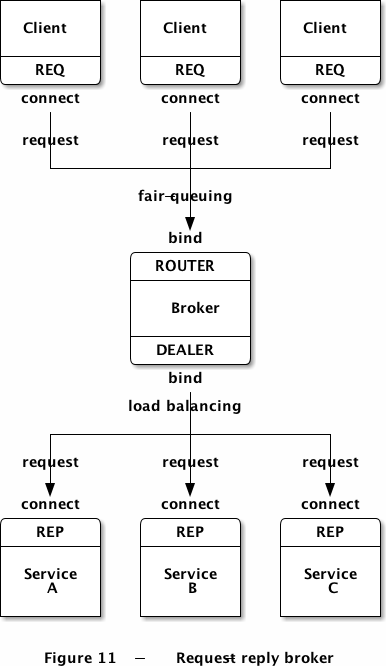
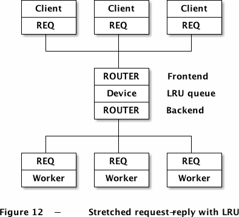
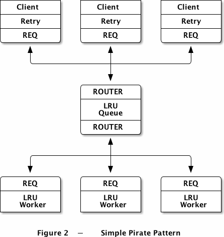

# 工具类使用
本章涉及的内容有：

* config(用于配置文件信息读取)
* jsoncpp(用于解析json格式内容)
* log4cpp(记录程序的执行日志)
* mysql(数据的存储，交互接口)
* redis(kv数据库，用于热点信息，与mysql之间存在数据更新)
* tinyxml(用于xml文件的读写操作)
* zeromq(消息中间件，用于进程间通信等)
---

## config

按照json文件里内容，解析需要的字段存储到m_ConfigMap中，用于后续函数处理。
```
map<string,string> m_ConfigMap;
[
   {"name" : "conf.json"},
   {"mysql_host" : "localhost","mysql_user" : "root","mysql_passwd" : "klczxas789","mysql_dbname" : "cloud_disk"},
   {"description" : "This is conf json"},
   {"type" : "json"}
]
```
执行结果:
```
[root@192 config]# ./config
Config Create!key=name,value=conf.json
key=mysql_dbname,value=cloud_disk
key=mysql_host,value=localhost
key=mysql_passwd,value=klczxas789
key=mysql_user,value=root
key=description,value=This is conf json
key=type,value=json

```
## jsoncpp

json格式的内容进行读取、解析、修改等。封装了json/json.h里的函数为JsonUtil类。

```
    std::cout << "-----set func test---------" << std::endl;
    JsonUtil::setStr(jsonStr, "aaa", "kkkkkkk");
    JsonUtil::setInt(jsonStr, "num", 1024);
    JsonUtil::setObj(newStr, "json", jsonStr);
    std::vector<std::string> testArray;
    testArray.push_back("1");
    testArray.push_back("2");
    JsonUtil::setArray(newStr, "array", testArray);
    JsonUtil::setStr(newStr, "strKey", "xxx");
    JsonUtil::setInt(newStr, "intKey", 102);
    std::cout << newStr << std::endl;
    // get func test
    std::cout << "------get func test---------" << std::endl;
    std::cout << JsonUtil::getInt(newStr, "intKey") << std::endl;
    std::cout << JsonUtil::getStr(newStr, "strKey") << std::endl;
    std::cout << JsonUtil::getObj(newStr, "json") << std::endl;
    std::vector<std::string> testGetArray;
    testGetArray = JsonUtil::getArray(newStr, "array");
```

执行结果:
```
-----set func test---------
{
   "array" : [ "1", "2" ],
   "intKey" : 102,
   "json" : {
      "aaa" : "kkkkkkk",
      "num" : 1024
   },
   "strKey" : "xxx"
}

------get func test---------
102
xxx
{
   "aaa" : "kkkkkkk",
   "num" : 1024
}

```
## log4cpp

log4cpp日志类的学习。

```
#include <log4cpp/PropertyConfigurator.hh>
#include <log4cpp/Category.hh>

#include"LoggerManager.h"
#include"sort.h"
#include"randomArray.h"
using namespace std; 
using namespace minilog;
using namespace algorithm::sort;
using namespace algorithm::klc;


int main() {
    Sort* mySort = new Sort();
	randomArray* myRandomArray = new randomArray();
    delete mySort;
    delete myRandomArray;
    return 0;
}

```

执行结果:
```
[root@192 log4cpp]# ./log4cppTest
[2021-01-04 05:52:09 - INFO](randomArray):LoggerManager created, name is randomArray
[2021-01-04 05:52:09 - INFO](Sort):LoggerManager created, name is Sort
[2021-01-04 05:52:09 - DEBUG](Sort):Sort Create
[2021-01-04 05:52:09 - INFO](randomArray):randomArray create
[2021-01-04 05:52:09 - WARN](Sort):Sort End
[2021-01-04 05:52:09 - ERROR](randomArray):randomArray End

```
## mysql
mysql数据库函数学习，以及封装DataBase类。

```
        std::map<std::string, std::string> params;
        //数据库的参数
        params["host"] = "localhost";
        params["user"] = "root";
        params["passwd"] = "klczxas789";
        params["dbname"] = "student";

        MySQL::ptr mysql(new MySQL(params));
        if(!mysql->connect()) {
            std::cout << "connect fail" << std::endl;
            return;
        }
		
		cout<<"查询studentInfo表的结果集"<<endl;
		std::string sql1 = "select * from studentInfo";
		ISQLData::ptr m_ptr1=mysql->query(sql1);
		m_ptr1->showAllRes(); 
		cout<<"——————————————————————————————"<<endl;
		
		cout<<"切换回student数据库，测试基本的函数"<<endl;
		mysql->use("student");
		std::string sql3 = "select * from studentInfo";
		ISQLData::ptr m_ptr3=mysql->query(sql3);
		cout<<"数据库名称:"<<mysql->getDbname()<<endl;
		cout<<"行:"<<m_ptr3->getDataCount()<<"	列:"<<m_ptr3->getColumnCount()<<endl;
		cout<<"表格字段内容："<<endl;
		for(int i=0;i<m_ptr3->getColumnCount();i++)
		{
			cout<<m_ptr3->getColumnName(i)<<" ";
		}
		cout<<endl;
```
执行结果:
```
[root@192 mysql]# ./mysqlTest
查询studentInfo表的结果集
1001 klc 1 95
1002 cf 2 100
1003 gsc 3 99
1004 lz 2 98
——————————————————————————————
切换回student数据库，测试基本的函数
数据库名称:student
行:4    列:4
表格字段内容：
id name class grade

```
## redis

redis数据库学习，CMyRedis封装。
```
try{
		myRedis.Connect("127.0.0.1",6379);
		cout<<"connect success!"<<endl;
		cout<<myRedis.CheckConenct()<<endl;
		myRedis.Connect("127.0.0.1", 6379);
		cout<<"check connect: "<<myRedis.CheckConenct()<<endl;
		myRedis.Set("hello", "world");
		cout<<myRedis.Get("Work")<<endl;
		myRedis.Set("set", "get");
		cout<<myRedis.Get("hello")<<endl;
        ......
}
```
执行结果:
```
[root@192 redis]# ./redisTest
connect success!
1
check connect: 1

world

```
## tinyxml

利用tinyxml先生成xml文件，再循环读取字段内容。
```
int main()
 {
	 printSchoolXml();
	 readSchoolXml();
	 writeSchoolXml();
	 return 0;
 }
```

执行结果:
```
[root@192 tinyxml]# ./tinyxmlTest
/home/zeromq/V2/deploy/ToolClass/tinyxml/../../../examples/ToolClass/tinyxml/conf/school.xml
<School name="计算机学院">
    <Class name="C++">
        <Student name="Jason" number="1001">
            <grade>98</grade>
            <address>China</address>
        </Student>
        <Student name="Steven" number="1002">
            <grade>80</grade>
            <address>america</address>
        </Student>
    </Class>
    <Class name="Java">
        <Student name="Lucy" number="1003">
            <grade>100</grade>
            <address>London</address>
        </Student>
        <Student name="Marry" number="1004">
            <grade>85</grade>
            <address>Japan</address>
        </Student>
    </Class>
</School>
name : Jason
number : 1001
grade : 98
address : China
name : Steven
number : 1002
grade : 80
address : america
name : Lucy
number : 1003
grade : 100
address : London
name : Marry
number : 1004
grade : 85
address : Japan
```


## ZeroMQ
pub_sub:
```
base_use:基本的PUB-SUB模式，pubServer只推送music和programing的内容，subClient可以指定订阅的内容，默认music
better_use:  server: ip:port + 多个topic,content对;client: ip:port + 多个要接收的topic。
syn_pubsub: syncpub中syncservice等待 SUBSCRIBERS_EXPECTED 数量的syncclient进行连接。等待连接建立后，
publisher发送10次更新消息给subscriber。
备注：5561端口用于消息发送，5562端口用于同步，syncsub进程要启动SUBSCRIBERS_EXPECTED个。
```
req_rep:
```
hello_world：基础的C/S架构，其中server负责发送World，接收Hello;client负责发送Hello,接收World。但是程序不包括发送和接收消息的解析
都是直接写在打印语句中。
pthread_use：在一个可执行程序中，创建多个线程，其中0线程是服务器，1线程是客户端，其他是工作线程。
pthread_use_s：进一步完善，通过zhelps.hpp的函数s_send和s_recv，完成C++程序的消息发送和接收，并不会存在pthread_use中需要解析字符串的问题。
req_rep_broker：request-reply broker 请求-应答代理可以客户-服务模式更容器伸缩，因为客户端看不见服务器，服务器也看不见
客户端。唯一稳定的节点是中间的代理。有代理的情况下,是rrbroker进行bind，rrserver和rrclient都是connect。
req_rep_identity：在request-reply模型中，封装拥有应答的返回地址。例子中，有identity为空的情况，XREP会自动生成
UUID用于传输套接字；在定义identity为Hello时，应答的时候使用这个identity作为应答的地址。
```

### req_rep_broker

请求-应答代理会将两个套接字分别绑定到前端和后端，供客户端和服务端套接字连接。在使用该装置之前，还需要对客户端和服务端的代码进行调整。下图描述了一个请求-应答模式，REQ和ROUTER通信(rrclient)，DEALER再和REP通信(rrserver)。ROUTER和DEALER之间我们则需要进行消息转发(rrbroker)：



### req_rep_lruqueue

ROUTER-ROUTER的LRU队列。
LRU算法，它要求client和worker都使用REQ套接字，并正确的存储和返回消息信封，具体如下:

* 创建一组poll，不断地从backend（worker端的ROUTER）获取消息；只有当有空闲的worker时才从frontend（client端的ROUTER）获取消息；
 
* 循环执行poll
 
* 如果backend有消息，只有两种情况：1）READY消息（该worker已准备好，等待分配）；2）应答消息（需要转发给client）。两种情况下我们都会保存worker的地址，放入LRU队列中，如果有应答内容，则转发给相应的client。

* 如果frontend有消息，我们从LRU队列中取出下一个worker，将该请求发送给它。这就需要发送[worker地址][空帧][client地址][空帧][请求内容]到worker端的ROUTER。

我们可以对该算法进行扩展，如在worker启动时做一个自我测试，计算出自身的处理速度，并随READY消息发送给代理，这样代理在分配工作时就可以做相应的安排。




### SimpleLazyPirate
基本的可靠队列（简单海盗模式）:
运行上述事例，启动多个worker，一个client，以及一个队列装置，顺序随意。你可以看到worker最终都会崩溃或死亡，client则多次重试并最终放弃。装置从来不会停止，你可以任意重启worker和client，这个模型可以和任意个worker、client交互。

```
[root@localhost zeromq]# ./spworker
I: (4BFA-5A56) worker ready
I: (4BFA-5A56) normal reply - I'm client Hello.
I: (4BFA-5A56) normal reply - I'm client Hello.
I: (4BFA-5A56) normal reply - I'm client Hello.
I: (4BFA-5A56) simulating a crash

[root@localhost zeromq]# ./spqueue

[root@localhost zeromq]# ./sp_client
Connecting to hello world server...
client Send I'm client Hello. 0
```

