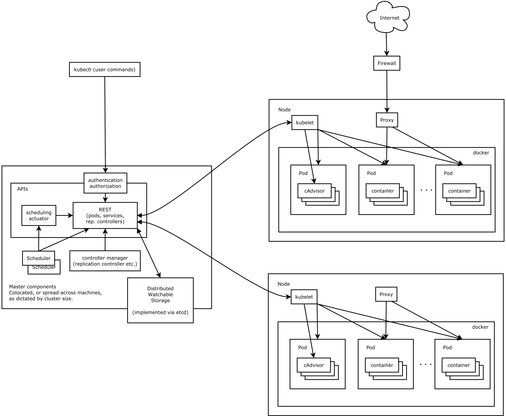
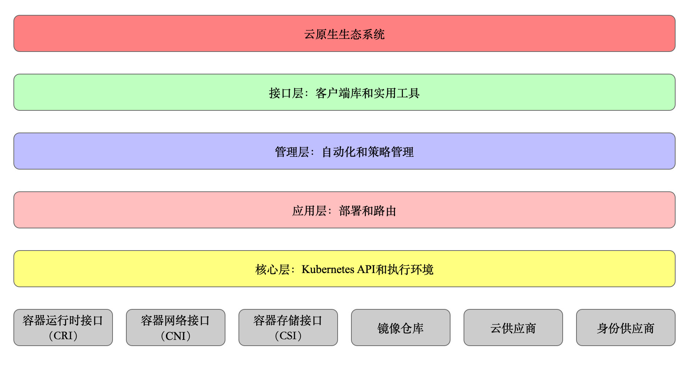
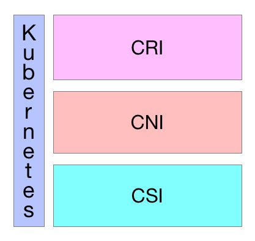

#  Kubernetes学习总结

涉及的内容有：

* 云原生的定义
* Kubernetes架构
* Serverless介绍

### 学习内容

* [Kubernetes-单机实验(入门)](https://www.cnblogs.com/douyi/p/11954910.html)
* [Kubernetes入门](https://www.cnblogs.com/zuoyang/p/9639961.html)
* [Kubernetes环境搭建(集群)](https://blog.csdn.net/u010884123/article/details/56485246)

---

## 云原生的定义

### CNCF最初的定义

到了2015年Google主导成立了云原生计算基金会（CNCF），起初CNCF对云原生（Cloud Native）的定义包含以下三个方面：

- 应用容器化
- 面向微服务架构
- 应用支持容器的编排调度

### 重定义

到了2018年，随着近几年来云原生生态的不断壮大，所有主流云计算供应商都加入了该基金会，且从[Cloud Native Landscape](https://i.cncf.io)中可以看出云原生有意蚕食原先非云原生应用的部分。CNCF基金会中的会员以及容纳的项目越来越多，该定义已经限制了云原生生态的发展，CNCF为云原生进行了重新定位。

以下是CNCF对云原生的重新定义（中英对照）：

> Cloud native technologies empower organizations to build and run scalable applications in modern, dynamic environments such as public, private, and hybrid clouds. Containers, service meshes, microservices, immutable infrastructure, and declarative APIs exemplify this approach.

云原生技术有利于各组织在公有云、私有云和混合云等新型动态环境中，构建和运行可弹性扩展的应用。云原生的代表技术包括容器、服务网格、微服务、不可变基础设施和声明式API。

> These techniques enable loosely coupled systems that are resilient, manageable, and observable. Combined with robust automation, they allow engineers to make high-impact changes frequently and predictably with minimal toil.

这些技术能够构建容错性好、易于管理和便于观察的松耦合系统。结合可靠的自动化手段，云原生技术使工程师能够轻松地对系统作出频繁和可预测的重大变更。

> The Cloud Native Computing Foundation seeks to drive adoption of this paradigm by fostering and sustaining an ecosystem of open source, vendor-neutral projects. We democratize state-of-the-art patterns to make these innovations accessible for everyone.

云原生计算基金会（CNCF）致力于培育和维护一个厂商中立的开源生态系统，来推广云原生技术。我们通过将最前沿的模式民主化，让这些创新为大众所用。

---

## Kubernetes架构

Kubernetes借鉴了Borg的设计理念，比如Pod、Service、Label和单Pod单IP等。Kubernetes的整体架构跟Borg非常像，如下图所示。

Kubernetes主要由以下几个核心组件组成：

- etcd保存了整个集群的状态；
- apiserver提供了资源操作的唯一入口，并提供认证、授权、访问控制、API注册和发现等机制；
- controller manager负责维护集群的状态，比如故障检测、自动扩展、滚动更新等；
- scheduler负责资源的调度，按照预定的调度策略将Pod调度到相应的机器上；
- kubelet负责维护容器的生命周期，同时也负责Volume（CSI）和网络（CNI）的管理；
- Container runtime负责镜像管理以及Pod和容器的真正运行（CRI）；
- kube-proxy负责为Service提供cluster内部的服务发现和负载均衡；

除了核心组件，还有一些推荐的插件，其中有的已经成为CNCF中的托管项目：

- CoreDNS负责为整个集群提供DNS服务
- Ingress Controller为服务提供外网入口
- Prometheus提供资源监控
- Dashboard提供GUI
- Federation提供跨可用区的集群

### 整体架构

Kubernetes的架构设计以及组件之间的通信协议。

### 分层架构

Kubernetes 设计理念和功能其实就是一个类似 Linux 的分层架构，如下图所示

* 核心层：Kubernetes 最核心的功能，对外提供 API 构建高层的应用，对内提供插件式应用执行环境
* 应用层：部署（无状态应用、有状态应用、批处理任务、集群应用等）和路由（服务发现、DNS 解析等）
* 管理层：系统度量（如基础设施、容器和网络的度量），自动化（如自动扩展、动态 Provision 等）以及策略管理（RBAC、Quota、PSP、NetworkPolicy 等）
* 接口层：kubectl 命令行工具、客户端 SDK 以及集群联邦
* 生态系统：在接口层之上的庞大容器集群管理调度的生态系统，可以划分为两个范畴
  * Kubernetes 外部：日志、监控、配置管理、CI、CD、Workflow、FaaS、OTS 应用、ChatOps 等
  * Kubernetes 内部：CRI、CNI、CVI、镜像仓库、Cloud Provider、集群自身的配置和管理等

---

## Serverless介绍

Serverless（无服务器架构）指的是由开发者实现的服务端逻辑运行在无状态的计算容器中，它由事件触发， 完全被第三方管理，其业务层面的状态则被开发者使用的数据库和存储资源所记录。

Serverless架构是云的自然延伸，为了理解serverless，我们有必要回顾一下云计算的发展。

* IaaS
  * 2006年AWS推出EC2（Elastic Compute Cloud），作为第一代IaaS（Infrastructure as a Service），用户可以通过AWS快速的申请到计算资源，并在上面部署自己的互联网服务。IaaS从本质上讲是服务器租赁并提供基础设施外包服务。就比如我们用的水和电一样，我们不会自己去引入自来水和发电，而是直接从自来水公司和电网公司购入，并根据实际使用付费。

* PaaS
  * PaaS（Platform as a Service）是构建在IaaS之上的一种平台服务，提供操作系统安装、监控和服务发现等功能，用户只需要部署自己的应用即可，最早的一代是Heroku。
  * 在PaaS上最广泛使用的技术就要数docker了，因为使用容器可以很清晰的描述应用程序，并保证环境一致性。管理云上的容器，可以称为是CaaS（Container as a Service），如GCE（Google Container Engine）。也可以基于Kubernetes、Mesos这类开源软件构件自己的CaaS，不论是直接在IaaS构建还是基于PaaS。
  * PaaS是对软件的一个更高的抽象层次，已经接触到应用程序的运行环境本身，可以由开发者自定义，而不必接触更底层的操作系统。

* Serverless
  * Serverless（无服务器架构）指的是服务端逻辑由开发者实现，运行在无状态的计算容器中，由事件触发， 完全被第三方管理，而业务层面的状态则记录在数据库或存储资源中。
  * Serverless不如IaaS和PaaS那么好理解，因为它通常包含了两个领域BaaS（Backend as a Service）和FaaS（Function as a Service）。
      * BaaS（Backend as a Service）后端即服务，一般是一个个的API调用后端或别人已经实现好的程序逻辑，比如身份验证服务Auth0，这些BaaS通常会用来管理数据，还有很多公有云上提供的我们常用的开源软件的商用服务，比如亚马逊的RDS可以替代我们自己部署的MySQL，还有各种其它数据库和存储服务。
      * FaaS（Functions as a Service）函数即服务，FaaS是无服务器计算的一种形式，当前使用最广泛的是AWS的Lambada。现在当大家讨论Serverless的时候首先想到的就是FaaS，有点甚嚣尘上了。FaaS本质上是一种事件驱动的由消息触发的服务，FaaS供应商一般会集成各种同步和异步的事件源，通过订阅这些事件源，可以突发或者定期的触发函数运行。(备注:两个与事件分离器有关的模式是Reactor和Proactor。Reactor模式采用同步IO,而Proactor采用异步IO。)
  * BaaS和FaaS两者都为我们的计算资源提供了弹性的保障，BaaS其实依然是服务外包，而FaaS使我们更加关注应用程序的逻辑，两者使我们不需要关注应用程序所在的服务器，但实际上服务器依然是客观存在的。

## 开放接口

Kubernetes作为云原生应用的基础调度平台，相当于云原生的操作系统，为了便于系统的扩展，Kubernetes中开放的以下接口，可以分别对接不同的后端，来实现自己的业务逻辑：

- **CRI（Container Runtime Interface）**：容器运行时接口，提供计算资源
- **CNI（Container Network Interface）**：容器网络接口，提供网络资源
- **CSI（Container Storage Interface**）：容器存储接口，提供存储资源

以上三种资源相当于一个分布式操作系统的最基础的几种资源类型，而Kuberentes是将他们粘合在一起的纽带。

